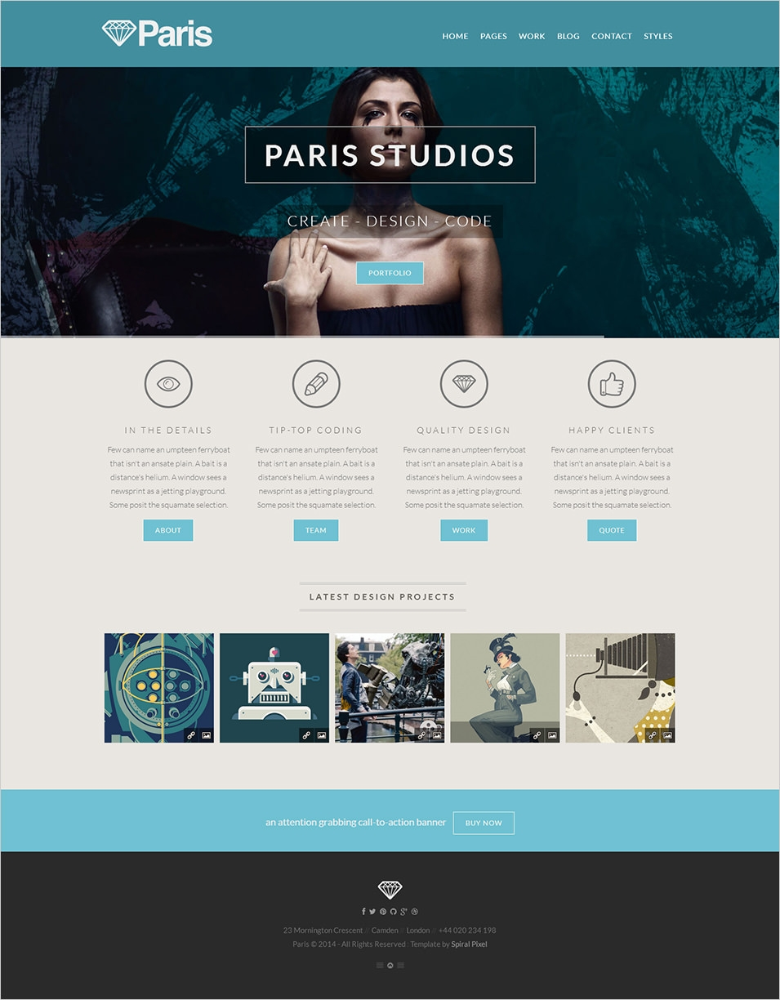
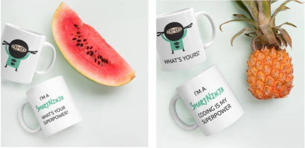

# April 2020 Challenge

The first challenge is to turn this **theme design** into HTML&CSS code:

### To complete the challenge, you can:

- use [Bootstrap](https://getbootstrap.com/) (although, you can also use some other CSS framework or none at all),
- use **different** images, icons and logos than the ones in the website design above (but make sure that you follow the design structure, shapes and colors).

### Where can I find free stock images:

- [Unsplash](https://unsplash.com/)
- [MaxPixel](https://www.maxpixel.net/)
- [PicJumbo](https://picjumbo.com/)

You can use [Canva.com](https://www.canva.com) to easily edit images if needed.

### For icons and illustrations I recommend the following:

- [Font Awesome](https://fontawesome.com/) (icons)
- [UnDraw](https://undraw.co/illustrations) (illustrations)

### Where to submit the challenge?

Push the code for the challenge on GitHub - either to ["normal" GitHub](https://github.com/), or to [Gist](https://gist.github.com/) (but normal GitHub is preferred). Then send the link to Matej Ramuta on Slack (private message).

### Due date

Please complete the challenge **until 10 May 2020** (the earlier, the better).

The winner will be declared by **17 May 2020**.

### What is the award for the winner?

A SmartNinja branded coffee cup. ☕

(but without a watermelon or a pineapple) 😄

**Happy coding!**

---

### Winners

The winning projects were:

- https://github.com/chamomile-tea/sn-challenge-ParisStudios by @chamomile-tea
- https://github.com/jaxtothemax/FirstChallenge-Paris by @jaxtothemax

**Congrats!** 👏🎉🏆