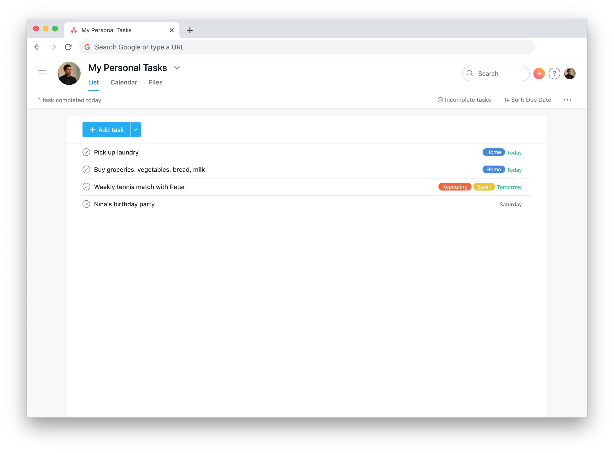

# September 2020 Challenge

Your task is to convert this TODO app (Asana) design into code:

This challenge consists of **two tiers**:

- A **static** website (frontend only)
- A **dynamic** website (frontend + backend)

You can **either** build a static website, **or** a dynamic website (there will be a reward for each tier).

### A static website (frontend only)

If you choose this tier, you will need to implement the design into **HTML & CSS** code (and **JS/jQuery** if you wish). The best design wins.

Make sure your design is **responsive**, which means it adapts to smaller screens (like mobile screens).

You can use **Bootstrap** if you want.

### A dynamic website (frontend + backend)

If you choose this tier, you'll need to create **both** front-end and back-end of the TODO web application.

For front-end use **HTML&CSS**. You can also use **Bootstrap**, **JavaScript**, and/or **jQuery** if you want (or even some JS framework, like **Vue** or **React**).

For the back-end, use **Python** and **Flask**.

An authentication system is **optional**.

### Icons and pictures

For icons I recommend [Font Awesome](https://fontawesome.com/), but you can also use something else.

You can use any picture as the profile picture in the web app.

### Where to submit the challenge?

Push your project code to **GitHub** - either to ["normal" GitHub](https://github.com/), or to [Gist](https://gist.github.com/) (but normal GitHub is preferred). Then send the link to **Matej Ramuta** via Slack (private message).

### Due date

Please complete the challenge <s>until 31 August 2020</s> **until 30 September 2020** (the date was extended due to summer holidays).

The winner will be declared by the **7 October 2020**.

### What are the rewards for the winners?

The winner of the **static website** challenge will receive **one** item of their choice from the SmartNinja merchandise inventory (our merch consists of T-shirts, stickers, caps, a card game, etc.)

The winner of the **dynamic website** challenge will receive **two** items of their choice from SmartNinja merchandise.

> The reward only applies to SmartNinja students from Austria, Germany, and Slovenia.

**Happy coding!**